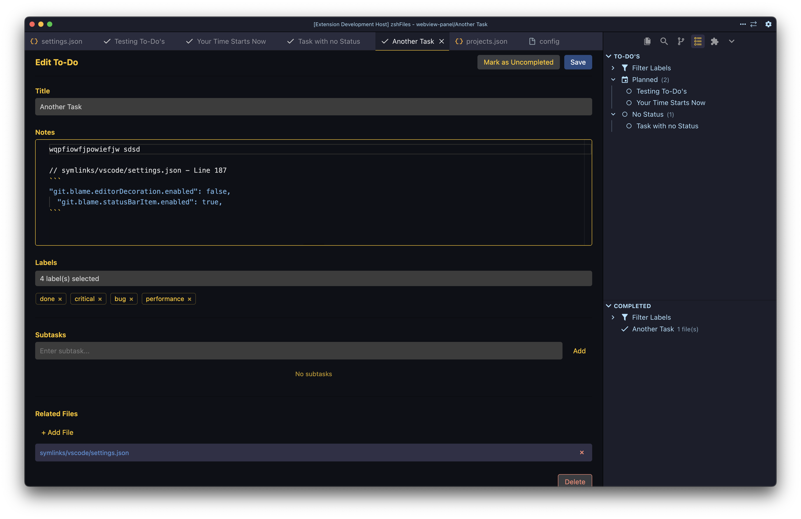
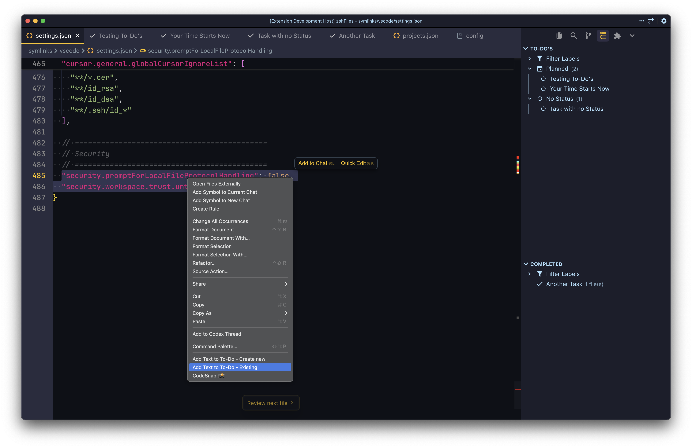

# Workspace To-do's

A VS Code extension to manage workspace-specific to-do lists directly in your editor. Organize tasks, track progress, and associate files with your todos. Syncs with Trello boards. 

## Features

- **Workspace-Specific**: Todos are stored per workspace in `.vscode/todos.json`
- **Drag-and-Drop Sorting**: Reorder todos by dragging them in the sidebar
  - Drag within sections to reorder, or between sections to move and update status
  - Sort order persists across VS Code sessions
- **Split Sidebar View**: Resizable sidebar with separate sections for active and completed todos
- **Label System**: Comprehensive labeling with categories (Priority, Type, Status, Quality, Scope)
  - Custom categories and label values
  - Radio button selection (one value per category)
- **Filter System**: Filter todos by labels in both active and completed sections
- **Rich Editor**: Monaco editor with Markdown support for detailed notes
- **File Associations**: Link files from your workspace to todos
- **Subtasks**: Break down todos into smaller subtasks with completion tracking
- **Context Menu Integration**: Add files or selected text to todos from Explorer and Editor
- **Quick Actions**: Toggle completion, edit, and delete todos directly from the sidebar
- **Smart Completion Toggle**: Mark todos as complete or uncomplete from the editor with dynamic button text
- **Auto-Save**: Automatic saving of changes to prevent data loss when switching tabs or files
- **Keyboard Shortcuts**: Configurable keyboard shortcuts for save, mark complete, delete, and create new todo
- **Editor Persistence**: Open todo editors automatically restore when workspace is reopened
- **Smart Editor Focus**: Clicking a todo in sidebar focuses existing editor instead of creating duplicate
- **Trello Sync (Optional)**: Two-way sync with Trello boards, per-workspace credentials, and list/status mapping

### Edit a To-Do



### Add text via Context Menu to a To-Do



## Table of Contents

- [Installation](#installation)
- [Quick Start](#quick-start)
- [Trello Setup](#trello-setup)
- [Usage](#usage)
  - [Sidebar View](#sidebar-view)
  - [Creating Todos](#creating-todos)
  - [Editing Todos](#editing-todos)
  - [Labels](#labels)
  - [Managing Files](#managing-files)
  - [Subtasks](#subtasks)
  - [Context Menu Actions](#context-menu-actions)
  - [Keyboard Shortcuts](#keyboard-shortcuts)
- [Commands](#commands)
- [Configuration](#configuration)
- [Data Storage](#data-storage)
- [Requirements](#requirements)
- [Troubleshooting](#troubleshooting)
- [FAQ](#faq)
- [Contributing](#contributing)
- [Support](#support)
- [License](#license)

## Installation

### Via VS Code Extensions Marketplace

1. Open VS Code
2. Go to Extensions view (`Ctrl+Shift+X` / `Cmd+Shift+X`)
3. Search for "Workspace To-do's"
4. Click Install

### Via Command Line (VS Code)

For Visual Studio Code (Microsoft Marketplace):

```bash
code --install-extension tarikkavaz.workspace-todos
```

### Via Open VSX Registry

For VSCodium or other VS Code forks using Open VSX Registry:

```bash
codium --install-extension tarikkavaz.workspace-todos
```

Or using the `ovsx` CLI tool:

```bash
ovsx install tarikkavaz.workspace-todos
```

You can also install directly from the [Open VSX Registry](https://open-vsx.org/extension/tarikkavaz/workspace-todos) in the Extensions view.

## Quick Start

1. Open a workspace folder in VS Code
2. Click the "Workspace To-do's" icon in the activity bar (left sidebar)
3. Click the `+` button to create your first todo
4. Enter a title and optional notes
5. Click "Save"

Your todos are automatically saved to `.vscode/todos.json` in your workspace.

## Trello Setup

Follow these steps to generate a Trello API key and token, then connect the extension.

### 1) Get your API key

1. Open: <https://trello.com/app-key>
2. Copy the **API key** shown on that page.

### 2) Generate a token

1. Open the authorize URL below in your browser (replace `YOUR_KEY` with your API key):

https://trello.com/1/authorize?expiration=never&name=WorkspaceTodos&scope=read,write&response_type=token&key=YOUR_KEY

2. Approve the request.
3. Copy the **token** shown after approval.

### 3) Store credentials in VS Code

1. Run **Trello: Set Credentials**.
2. Paste:
   - **API key** from step 1
   - **Token** from step 2

### Notes

- You do **not** use the API **secret** for this extension.
- The key+token are **per Trello account**, not per board.
- One token works for **any board that account can access** (member/invited).

## Usage

### Sidebar View

The extension adds a new view to the activity bar sidebar with two resizable sections. Click the "Workspace To-do's" icon to see:

#### To-do's Section (Top)

- **Filter Labels**: Filter todos by selecting labels from the filter panel
- **Status-Grouped Sections**: Active todos organized by status labels
  - "In Progress" appears first
  - Other status sections (Backlog, Planned, Review, etc.)
  - "No Status" section for todos without status labels
- **Drag-and-Drop Sorting**: Drag todos to reorder within sections or move between sections
  - Drag a todo to reorder it within the same status section
  - Drag a todo to a different status section to move it and automatically update its status
  - Sort order is saved and persists across VS Code sessions
- Each todo shows:
  - Title (or first line of notes if no title)
  - Checkmark icon for completed todos, circle for active
  - Number of associated files (if any)

#### Trello Section (Middle)

- Separate Trello view for active Trello cards
- Uses Trello list → status mapping from settings
- Filter labels are independent from local todos

#### Completed Section (Bottom)

- All completed/done todos in a separate resizable section
- Independent filter system
- **Drag-and-Drop Sorting**: Drag completed todos to reorder them
- Checkmark icon to mark todos as uncompleted
- Trello-completed items display a Trello icon

You can resize the sections by dragging the divider between them.

### Creating Todos

1. Click the `+` button in the sidebar view title bar, or
2. Use the Command Palette (`Ctrl+Shift+P` / `Cmd+Shift+P`) and select "Workspace To-do's: Add To-Do"

In the editor panel:

- Enter a **Title** (required)
- Add **Notes** using the Markdown editor (optional)
- Select **Labels** from categories (Priority, Type, Status, Quality, Scope)
  - Only one value per category (radio button selection)
  - Status category appears first for quick access
  - Custom categories can be added via settings
- Add **Subtasks** by typing and clicking "Add" (optional)
- Associate **Files** by clicking "+ Add File" (optional)
- Click **Save** to create the todo

### Editing Todos

- Click on any todo in the sidebar to open it in the editor (focuses existing editor if already open)
- Or right-click a todo and select "Edit"
- Make your changes - they will be automatically saved (see [Auto-Save](#auto-save) below)
- You can also click "Save" for immediate manual save
- The sidebar automatically refreshes when you change labels

**Marking Todos as Complete/Uncomplete:**

- When editing a todo, use the "Mark as Complete" button in the editor header
- The button text automatically changes to "Mark as Uncompleted" for completed todos
- Clicking the button toggles the completion status without closing the editor
- The button text and success message update immediately to reflect the new status
- Completing a todo automatically adds "status:done" label
- Uncompleting a todo removes all status labels

### Auto-Save

The extension automatically saves your changes to prevent data loss:

- **Debounced Auto-Save**: Changes are automatically saved 500ms after you stop typing
- **Periodic Saves**: Your work is saved every 5 seconds while editing
- **Save on Tab Switch**: Changes are immediately saved when you switch to another file or tab
- **Visual Feedback**: The editor header shows "Saving..." and "Saved" indicators
- **Manual Save**: The "Save" button is still available for explicit control and immediate feedback

**Note:** The manual "Save" button provides immediate feedback with a notification, while auto-save is silent with only the visual indicator.

### Managing Files

**Adding Files:**

- Click "+ Add File" in the todo editor to browse and select files
- Or right-click a file in Explorer and select:
  - "Add File to To-Do - Existing" to add to an existing todo
  - "Add File to To-Do - Create new" to create a new todo with that file

**Opening Files:**

- Click on any file name in the todo editor to open it in VS Code

**Removing Files:**

- Click the `×` button next to a file in the todo editor

### Subtasks

Break down your todos into smaller, trackable subtasks:

1. In the todo editor, type a subtask in the input field
2. Click "Add" or press Enter
3. Check off subtasks as you complete them
4. Remove subtasks by clicking the `×` button

### Labels

The extension supports a comprehensive label system for organizing your todos:

**Default Categories:**

- **Priority**: blocker, critical, high, medium, low, trivial
- **Type**: bug, feature, enhancement, refactor, documentation, test
- **Quality/Concern Area**: performance, security, accessibility, usability, maintainability
- **Status**: backlog, planned, in-progress, review, blocked, done
- **Scope**: frontend, backend, api, infra, ci, docs

**Features:**

- **One per Category**: Radio button selection ensures only one value per category
- **Custom Categories**: Add your own categories through settings
- **Hide Options**: Hide default categories or specific labels you don't use
- **Filtering**: Filter todos by labels in both active and completed sections

**Selecting Labels:**

1. In the todo editor, click "Select labels..." dropdown
2. Categories are grouped together
3. Status category appears first for quick access
4. Click a radio button to select (replaces previous selection in that category)
5. Selected labels appear as badges below the dropdown

**Configuration:**
See [Configuration](#configuration) section for label settings.

### Context Menu Actions

**From Explorer (File Context Menu):**

- **Add File to To-Do - Existing**: Add the selected file(s) to an existing todo
- **Add File to To-Do - Create new**: Create a new todo with the selected file(s)

**From Editor (Text Selection):**

- **Add Text to To-Do - Existing**: Add the selected text to an existing todo's notes
- **Add Text to To-Do - Create new**: Create a new todo with the selected text

When adding text, the extension automatically:

- Includes the file path and line number
- Formats the text in a code block
- Adds the file to the todo's associated files

### Keyboard Shortcuts

The extension provides keyboard shortcuts for quick access to common actions. All shortcuts are customizable through VS Code's Keyboard Shortcuts UI (`Ctrl+K Ctrl+S` / `Cmd+K Cmd+S`).

#### When To-Do Editor is Open

These shortcuts only work when a To-Do is open in the editor:

- `Ctrl+S` / `Cmd+S`: Save the current To-Do

  - Saves all changes (title, notes, files, subtasks)
  - Works for both new and existing todos

- `Ctrl+Enter` / `Cmd+Enter`: Mark To-Do as Complete/Uncompleted

  - Toggles the completion status of the current todo
  - Button text and success message update automatically
  - Editor remains open after toggling

- `Ctrl+Delete` / `Cmd+Delete`: Delete the current To-Do

  - Shows a confirmation dialog before deleting
  - Closes the editor after deletion

#### Global Shortcuts

These shortcuts work from anywhere in VS Code:

- `Ctrl+Alt+N` / `Control+Cmd+N`: Create a new To-Do
  - Opens the To-Do editor with a blank form
  - Works from the sidebar, editor, or any view

#### Customizing Shortcuts

To customize or change any keyboard shortcut:

1. Open Keyboard Shortcuts UI:

   - Press `Ctrl+K Ctrl+S` (Windows/Linux) or `Cmd+K Cmd+S` (Mac)
   - Or go to `File` → `Preferences` → `Keyboard Shortcuts`

2. Search for "Workspace To-do's" or the specific command name

3. Click on the shortcut you want to change and press your desired key combination

4. To remove a shortcut, right-click and select "Remove Keybinding"

**Available Commands for Customization:**

- `Workspace To-do's: Save To-Do` - Save action in editor
- `Workspace To-do's: Mark To-Do as Complete` - Toggle completion in editor
- `Workspace To-do's: Delete To-Do` - Delete action in editor
- `Workspace To-do's: Add To-Do` - Create new todo (global)

## Commands

All commands are available via the Command Palette (`Ctrl+Shift+P` / `Cmd+Shift+P`):

- `Workspace To-do's: Add To-Do` - Create a new todo
- `Workspace To-do's: Refresh` - Refresh the sidebar view
- `Workspace To-do's: Edit` - Edit the selected todo (context menu)
- `Workspace To-do's: Toggle Complete` - Mark todo as complete/incomplete (context menu - active section)
- `Workspace To-do's: Mark as Uncompleted` - Mark completed todo as incomplete (context menu - completed section)
- `Workspace To-do's: Delete` - Delete the selected todo (context menu)
- `Workspace To-do's: Toggle Filter Label` - Toggle a label filter on/off (context menu on filter labels)
- `Workspace To-do's: Clear Filters` - Clear all active label filters (context menu on filter section)
- `Workspace To-do's: Add File to To-Do - Existing` - Add file to existing todo (Explorer context)
- `Workspace To-do's: Add File to To-Do - Create new` - Create todo with file (Explorer context)
- `Workspace To-do's: Add Text to To-Do - Existing` - Add text to existing todo (Editor context)
- `Workspace To-do's: Add Text to To-Do - Create new` - Create todo with text (Editor context)
- `Trello: Set Credentials` - Store Trello API key + token for this workspace
- `Trello: Clear Credentials` - Clear Trello credentials for this workspace
- `Trello: Sync Now` - Run Trello sync immediately
- `Trello: Prune Missing Cards` - Remove local Trello items whose cards no longer exist

## Configuration

You can customize where the extension stores `todos.json` and exports `todos.md` by configuring these settings in your VS Code `settings.json`:

### `workspaceTodos.todosDirectory`

Directory path (relative to workspace root) where `todos.json` file will be saved.

**Default:** `.vscode`

**Example:**

```json
{
  "workspaceTodos.todosDirectory": ".vscode"
}
```

Or to store todos in a different location:

```json
{
  "workspaceTodos.todosDirectory": "docs"
}
```

This will save `todos.json` to `docs/todos.json` instead of `.vscode/todos.json`.

### `workspaceTodos.markdownExportPath`

Directory path (relative to workspace root) where `todos.md` file will be exported when using the "Export To Markdown" command.

**Default:** `.vscode`

**Example:**

```json
{
  "workspaceTodos.markdownExportPath": ".vscode"
}
```

Or to export to a different location:

```json
{
  "workspaceTodos.markdownExportPath": "exports"
}
```

This will save `todos.md` to `exports/todos.md` instead of `.vscode/todos.md`. The directory will be created automatically if it doesn't exist.

### `workspaceTodos.defaultStatus`

Default status to apply to newly created To-Do's when no status is explicitly set during creation.

**Default:** `""` (empty - no default status)

**Example:**

```json
{
  "workspaceTodos.defaultStatus": "backlog"
}
```

This will automatically assign the `status:backlog` label to any new To-Do that doesn't have a status selected. The default status will be pre-selected in the editor when creating a new To-Do.

**Valid values:** Any status value from your configuration (default: `backlog`, `planned`, `in-progress`, `blocked`, `review`, `done`).

Leave empty to keep the current behavior where new To-Do's have no status by default.

### Trello Settings

Enable and configure Trello sync per workspace. Credentials are stored per workspace via **Trello: Set Credentials**.

```json
{
  "workspaceTodos.trello.enabled": true,
  "workspaceTodos.trello.board": "https://trello.com/b/BOARD_ID/board-name",
  "workspaceTodos.trello.listMapping": {
    "To-Do": "planned",
    "Doing": "in-progress",
    "Done": "done"
  },
  "workspaceTodos.trello.assignedUsername": "your-username",
  "workspaceTodos.trello.assignedOnly": true,
  "workspaceTodos.trello.syncIntervalMinutes": 0,
  "workspaceTodos.trello.syncLocalTodos": false
}
```

**Notes:**

- Use your **Trello username** (not email).
- List mappings match **exact list names** or list IDs.
- `assignedOnly` hides cards not assigned to your username.
- `syncLocalTodos` controls whether local-only todos create Trello cards.

### `workspaceTodos.labels`

Comprehensive label system configuration for organizing todos with categories and values.

**Structure:**

```json
{
  "workspaceTodos.labels": {
    "categories": {
      "priority": {
        "values": ["blocker", "critical", "high", "medium", "low", "trivial"]
      },
      "status": {
        "values": ["backlog", "planned", "in-progress", "review", "blocked", "done"]
      }
    },
    "hiddenCategories": [],
    "hiddenLabels": [],
    "custom": {
      "team": {
        "values": ["frontend-team", "backend-team", "devops"]
      }
    }
  }
}
```

**Properties:**

- `categories`: Default category definitions with values
- `hiddenCategories`: Array of category names to hide from UI (e.g., `["scope"]`)
- `hiddenLabels`: Array of specific labels to hide (format: `"category:value"`, e.g., `["priority:trivial"]`)
- `custom`: Custom category definitions (same structure as categories)

**Example - Hide a Category:**

```json
{
  "workspaceTodos.labels": {
    "hiddenCategories": ["scope"]
  }
}
```

**Example - Hide Specific Labels:**

```json
{
  "workspaceTodos.labels": {
    "hiddenLabels": ["priority:trivial", "type:test"]
  }
}
```

### How to Configure

1. Open VS Code Settings:

   - Press `Ctrl+,` (Windows/Linux) or `Cmd+,` (macOS), or
   - Go to `File` → `Preferences` → `Settings` (Windows/Linux) or `Code` → `Preferences` → `Settings` (macOS)

2. Search for "Workspace To-do's" in the settings search bar

3. Or edit `settings.json` directly:

   - Open Command Palette (`Ctrl+Shift+P` / `Cmd+Shift+P`)
   - Select "Preferences: Open User Settings (JSON)" or "Preferences: Open Workspace Settings (JSON)"
   - Add the configuration options as shown above

## Data Storage

Todos are stored in `todos.json` in your workspace. By default, this file is located at `.vscode/todos.json` in your workspace root. You can customize this location using the `workspaceTodos.todosDirectory` setting.

**Default File Location:** `.vscode/todos.json`

The file is created automatically when you create your first todo.

**File Format:**

```json
{
  "todos": [
    {
      "id": "unique-id",
      "title": "Todo title",
      "notes": "Markdown notes",
      "completed": false,
      "labels": ["priority:high", "type:bug", "status:in-progress"],
      "files": ["relative/path/to/file.js"],
      "subtasks": [
        {
          "text": "Subtask description",
          "completed": false
        }
      ],
      "createdAt": "2026-01-13T10:00:00.000Z",
      "updatedAt": "2026-01-13T10:00:00.000Z"
    }
  ]
}
```

**Note:** The default `.vscode` folder is typically excluded from version control, so your todos remain local to your workspace. If you want to share todos with your team, you can commit the `todos.json` file to your repository. You can also configure a custom location using the `workspaceTodos.todosDirectory` setting if you prefer a different location.

## Requirements

- VS Code 1.60.0 or higher

## Troubleshooting

### Todos Not Appearing

**Problem**: The sidebar shows "No To-Dos yet" but you know todos exist.

**Solutions**:

- Click the refresh button (circular arrow icon) in the sidebar
- Check that you have a workspace folder open (not just files)
- Verify that `.vscode/todos.json` exists and contains valid JSON
- Check the Output panel (`View` → `Output` → select "Workspace Todos" from dropdown) for errors

### Cannot Create Todo

**Problem**: Error when trying to create a todo.

**Solutions**:

- Ensure you have a workspace folder open (not just individual files)
- Check that you have write permissions in the workspace directory
- Verify that `.vscode` directory can be created (check permissions)

### Files Not Opening

**Problem**: Clicking on a file in the todo editor doesn't open it.

**Solutions**:

- Verify the file path is correct and relative to the workspace root
- Check that the file still exists at that location
- Ensure the workspace folder hasn't changed

### Monaco Editor Not Loading

**Problem**: The notes editor shows a plain textarea instead of Monaco editor.

**Solutions**:

- This is a fallback behavior - the extension will still work with the textarea
- Try reloading the VS Code window (`Ctrl+R` / `Cmd+R`)
- Check that `node_modules/monaco-editor` exists (run `pnpm install` if needed)

### Context Menu Items Not Appearing

**Problem**: Right-click context menu options are missing.

**Solutions**:

- Reload the VS Code window (`Ctrl+R` / `Cmd+R` or `Ctrl+Shift+P` → "Developer: Reload Window")
- Verify the extension is installed and enabled
- For file context menu: Right-click on a file in Explorer (not a folder)
- For text context menu: Select text in an editor first

## FAQ

### Can I use this extension without a workspace folder?

No, the extension requires a workspace folder to be open because todos are stored per workspace in `.vscode/todos.json`.

### Are todos synced across machines?

No, todos are stored locally in your workspace. If you use VS Code Settings Sync, you can optionally include `.vscode/todos.json` in your sync settings, or commit it to your repository to share with your team.

### Can I export my todos?

Yes! You can export your todos to Markdown format:

- Click the "Export To Markdown" button in the sidebar title bar, or
- Use the Command Palette: "Workspace To-do's: Export To Markdown"
- Export creates `todos.md` with status-based sections and preserves your sort order
- You can also copy the contents of `.vscode/todos.json` - the file uses a simple JSON format that's easy to parse

### How do I delete all todos?

You can delete the `.vscode/todos.json` file, or delete individual todos using the context menu in the sidebar.

### Can I use Markdown in notes?

Yes! The notes field uses Monaco Editor with Markdown support, so you can use full Markdown syntax including code blocks, links, lists, etc.

### Do subtasks sync with the main todo completion status?

No, subtasks are independent. You can have a todo with some completed and some incomplete subtasks. The main todo completion status is separate.

### What happens if I delete a file that's associated with a todo?

The file path will remain in the todo's file list, but clicking it will show an error. You can manually remove it from the todo editor.

## Contributing

Contributions are welcome! Here's how you can help:

1. **Fork the repository** and create your feature branch (`git checkout -b feature/AmazingFeature`)
2. **Make your changes** following the existing code style
3. **Test your changes** thoroughly
4. **Commit your changes** with clear commit messages (`git commit -m 'Add some AmazingFeature'`)
5. **Push to the branch** (`git push origin feature/AmazingFeature`)
6. **Open a Pull Request**

### Development Setup

1. Clone the repository
2. Install dependencies: `pnpm install`
3. Open the folder in VS Code
4. Press `F5` to open a new Extension Development Host window
5. Make changes and test in the development window

### Reporting Bugs

Please use the [GitHub Issues](https://github.com/tarikkavaz/workspace-todos/issues) page to report bugs. Include:

- VS Code version
- Operating system
- Extension version
- Steps to reproduce
- Expected vs actual behavior
- Any error messages from the Output panel

## Support

- **Issues**: [GitHub Issues](https://github.com/tarikkavaz/workspace-todos/issues)
- **Repository**: [GitHub Repository](https://github.com/tarikkavaz/workspace-todos)
- **VS Code Marketplace**: [Extension Page](https://marketplace.visualstudio.com/items?itemName=tarikkavaz.workspace-todos)

If you find this extension helpful, please consider giving it a star on GitHub!

## License

MIT