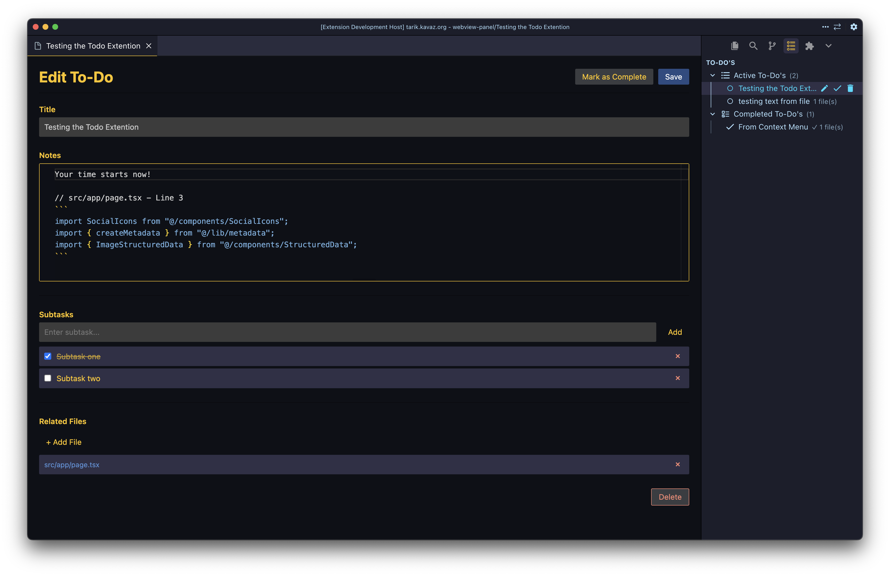

# Workspace To-do's

A VS Code extension to manage workspace-specific to-do lists directly in your editor. Organize tasks, track progress, and associate files with your todos.



## Features

- **Workspace-Specific**: Todos are stored per workspace in `.vscode/todos.json`
- **Sidebar View**: Access your todos from the activity bar sidebar
- **Rich Editor**: Monaco editor with Markdown support for detailed notes
- **File Associations**: Link files from your workspace to todos
- **Subtasks**: Break down todos into smaller subtasks with completion tracking
- **Context Menu Integration**: Add files or selected text to todos from Explorer and Editor
- **Quick Actions**: Toggle completion, edit, and delete todos directly from the sidebar
- **Organized View**: Todos are grouped into "Active" and "Completed" sections

## Table of Contents

- [Installation](#installation)
- [Quick Start](#quick-start)
- [Usage](#usage)
  - [Sidebar View](#sidebar-view)
  - [Creating Todos](#creating-todos)
  - [Editing Todos](#editing-todos)
  - [Managing Files](#managing-files)
  - [Subtasks](#subtasks)
  - [Context Menu Actions](#context-menu-actions)
- [Commands](#commands)
- [Data Storage](#data-storage)
- [Requirements](#requirements)
- [Troubleshooting](#troubleshooting)
- [FAQ](#faq)
- [Contributing](#contributing)
- [Support](#support)
- [License](#license)

## Installation

### Via VS Code Extensions Marketplace

1. Open VS Code
2. Go to Extensions view (`Ctrl+Shift+X` / `Cmd+Shift+X`)
3. Search for "Workspace To-do's"
4. Click Install

### Via Command Line (VS Code)

For Visual Studio Code (Microsoft Marketplace):

```bash
code --install-extension tarikkavaz.workspace-todos
```

### Via Open VSX Registry

For VSCodium or other VS Code forks using Open VSX Registry:

```bash
codium --install-extension tarikkavaz.workspace-todos
```

Or using the `ovsx` CLI tool:

```bash
ovsx install tarikkavaz.workspace-todos
```

You can also install directly from the [Open VSX Registry](https://open-vsx.org/extension/tarikkavaz/workspace-todos) in the Extensions view.

## Quick Start

1. Open a workspace folder in VS Code
2. Click the "Workspace To-do's" icon in the activity bar (left sidebar)
3. Click the `+` button to create your first todo
4. Enter a title and optional notes
5. Click "Save"

Your todos are automatically saved to `.vscode/todos.json` in your workspace.

## Usage

### Sidebar View

The extension adds a new view to the activity bar sidebar. Click the "Workspace To-do's" icon to see:

- **Active To-do's**: Todos that are not yet completed
- **Completed To-do's**: Todos that have been marked as complete

Each todo shows:
- Title (or first line of notes if no title)
- Completion status
- Number of associated files (if any)

### Creating Todos

1. Click the `+` button in the sidebar view title bar, or
2. Use the Command Palette (`Ctrl+Shift+P` / `Cmd+Shift+P`) and select "Workspace To-do's: Add To-Do"

In the editor panel:
- Enter a **Title** (required)
- Add **Notes** using the Markdown editor (optional)
- Add **Subtasks** by typing and clicking "Add" (optional)
- Associate **Files** by clicking "+ Add File" (optional)
- Click **Save** to create the todo

### Editing Todos

- Click on any todo in the sidebar to open it in the editor
- Or right-click a todo and select "Edit"
- Make your changes and click "Save"

### Managing Files

**Adding Files:**
- Click "+ Add File" in the todo editor to browse and select files
- Or right-click a file in Explorer and select:
  - "Add File to To-Do - Existing" to add to an existing todo
  - "Add File to To-Do - Create new" to create a new todo with that file

**Opening Files:**
- Click on any file name in the todo editor to open it in VS Code

**Removing Files:**
- Click the `×` button next to a file in the todo editor

### Subtasks

Break down your todos into smaller, trackable subtasks:

1. In the todo editor, type a subtask in the input field
2. Click "Add" or press Enter
3. Check off subtasks as you complete them
4. Remove subtasks by clicking the `×` button

### Context Menu Actions

**From Explorer (File Context Menu):**
- **Add File to To-Do - Existing**: Add the selected file(s) to an existing todo
- **Add File to To-Do - Create new**: Create a new todo with the selected file(s)

**From Editor (Text Selection):**
- **Add Text to To-Do - Existing**: Add the selected text to an existing todo's notes
- **Add Text to To-Do - Create new**: Create a new todo with the selected text

When adding text, the extension automatically:
- Includes the file path and line number
- Formats the text in a code block
- Adds the file to the todo's associated files

## Commands

All commands are available via the Command Palette (`Ctrl+Shift+P` / `Cmd+Shift+P`):

- `Workspace To-do's: Add To-Do` - Create a new todo
- `Workspace To-do's: Refresh` - Refresh the sidebar view
- `Workspace To-do's: Edit` - Edit the selected todo (context menu)
- `Workspace To-do's: Toggle Complete` - Mark todo as complete/incomplete (context menu)
- `Workspace To-do's: Delete` - Delete the selected todo (context menu)
- `Workspace To-do's: Add File to To-Do - Existing` - Add file to existing todo (Explorer context)
- `Workspace To-do's: Add File to To-Do - Create new` - Create todo with file (Explorer context)
- `Workspace To-do's: Add Text to To-Do - Existing` - Add text to existing todo (Editor context)
- `Workspace To-do's: Add Text to To-Do - Create new` - Create todo with text (Editor context)

## Data Storage

Todos are stored in `.vscode/todos.json` in your workspace root. This file is created automatically when you create your first todo.

**File Location:** `.vscode/todos.json`

**File Format:**
```json
{
  "todos": [
    {
      "id": "unique-id",
      "title": "Todo title",
      "notes": "Markdown notes",
      "completed": false,
      "files": ["relative/path/to/file.js"],
      "subtasks": [
        {
          "text": "Subtask description",
          "completed": false
        }
      ]
    }
  ]
}
```

**Note:** The `.vscode` folder is typically excluded from version control, so your todos remain local to your workspace. If you want to share todos with your team, you can commit `.vscode/todos.json` to your repository.

## Requirements

- VS Code 1.60.0 or higher

## Troubleshooting

### Todos Not Appearing

**Problem**: The sidebar shows "No To-Dos yet" but you know todos exist.

**Solutions**:
- Click the refresh button (circular arrow icon) in the sidebar
- Check that you have a workspace folder open (not just files)
- Verify that `.vscode/todos.json` exists and contains valid JSON
- Check the Output panel (`View` → `Output` → select "Workspace Todos" from dropdown) for errors

### Cannot Create Todo

**Problem**: Error when trying to create a todo.

**Solutions**:
- Ensure you have a workspace folder open (not just individual files)
- Check that you have write permissions in the workspace directory
- Verify that `.vscode` directory can be created (check permissions)

### Files Not Opening

**Problem**: Clicking on a file in the todo editor doesn't open it.

**Solutions**:
- Verify the file path is correct and relative to the workspace root
- Check that the file still exists at that location
- Ensure the workspace folder hasn't changed

### Monaco Editor Not Loading

**Problem**: The notes editor shows a plain textarea instead of Monaco editor.

**Solutions**:
- This is a fallback behavior - the extension will still work with the textarea
- Try reloading the VS Code window (`Ctrl+R` / `Cmd+R`)
- Check that `node_modules/monaco-editor` exists (run `pnpm install` if needed)

### Context Menu Items Not Appearing

**Problem**: Right-click context menu options are missing.

**Solutions**:
- Reload the VS Code window (`Ctrl+R` / `Cmd+R` or `Ctrl+Shift+P` → "Developer: Reload Window")
- Verify the extension is installed and enabled
- For file context menu: Right-click on a file in Explorer (not a folder)
- For text context menu: Select text in an editor first

## FAQ

### Can I use this extension without a workspace folder?

No, the extension requires a workspace folder to be open because todos are stored per workspace in `.vscode/todos.json`.

### Are todos synced across machines?

No, todos are stored locally in your workspace. If you use VS Code Settings Sync, you can optionally include `.vscode/todos.json` in your sync settings, or commit it to your repository to share with your team.

### Can I export my todos?

Yes, you can copy the contents of `.vscode/todos.json` to export your todos. The file uses a simple JSON format that's easy to parse.

### How do I delete all todos?

You can delete the `.vscode/todos.json` file, or delete individual todos using the context menu in the sidebar.

### Can I use Markdown in notes?

Yes! The notes field uses Monaco Editor with Markdown support, so you can use full Markdown syntax including code blocks, links, lists, etc.

### Do subtasks sync with the main todo completion status?

No, subtasks are independent. You can have a todo with some completed and some incomplete subtasks. The main todo completion status is separate.

### What happens if I delete a file that's associated with a todo?

The file path will remain in the todo's file list, but clicking it will show an error. You can manually remove it from the todo editor.

## Contributing

Contributions are welcome! Here's how you can help:

1. **Fork the repository** and create your feature branch (`git checkout -b feature/AmazingFeature`)
2. **Make your changes** following the existing code style
3. **Test your changes** thoroughly
4. **Commit your changes** with clear commit messages (`git commit -m 'Add some AmazingFeature'`)
5. **Push to the branch** (`git push origin feature/AmazingFeature`)
6. **Open a Pull Request**

### Development Setup

1. Clone the repository
2. Install dependencies: `pnpm install`
3. Open the folder in VS Code
4. Press `F5` to open a new Extension Development Host window
5. Make changes and test in the development window

### Reporting Bugs

Please use the [GitHub Issues](https://github.com/tarikkavaz/workspace-todos/issues) page to report bugs. Include:
- VS Code version
- Operating system
- Extension version
- Steps to reproduce
- Expected vs actual behavior
- Any error messages from the Output panel

## Support

- **Issues**: [GitHub Issues](https://github.com/tarikkavaz/workspace-todos/issues)
- **Repository**: [GitHub Repository](https://github.com/tarikkavaz/workspace-todos)
- **VS Code Marketplace**: [Extension Page](https://marketplace.visualstudio.com/items?itemName=tarikkavaz.workspace-todos)

If you find this extension helpful, please consider giving it a star on GitHub!

## License

MIT
